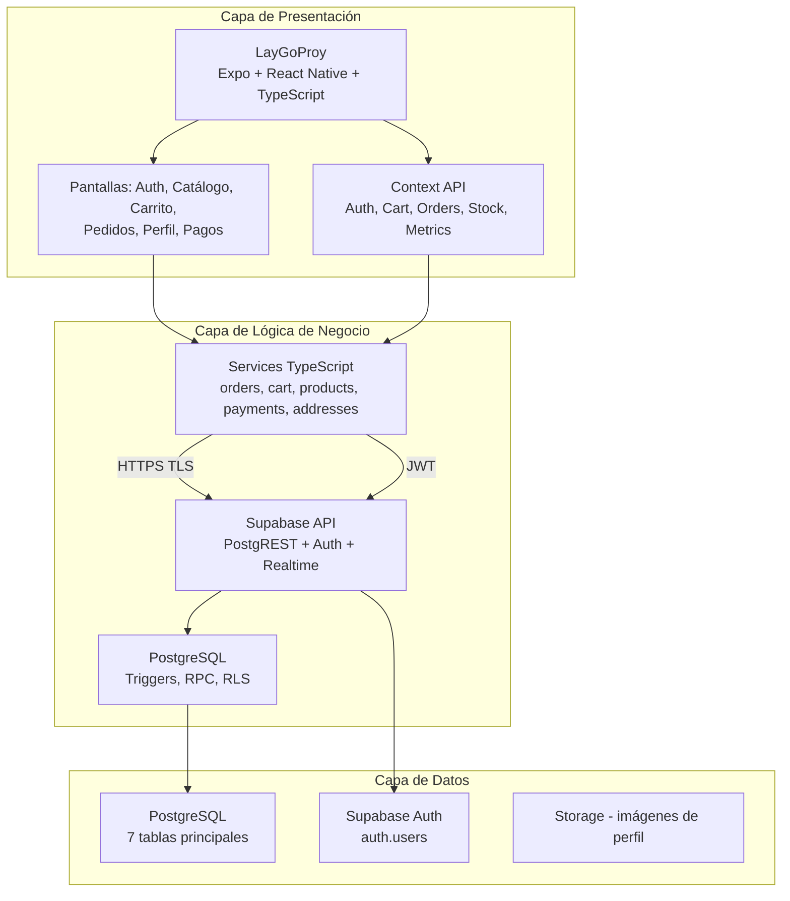
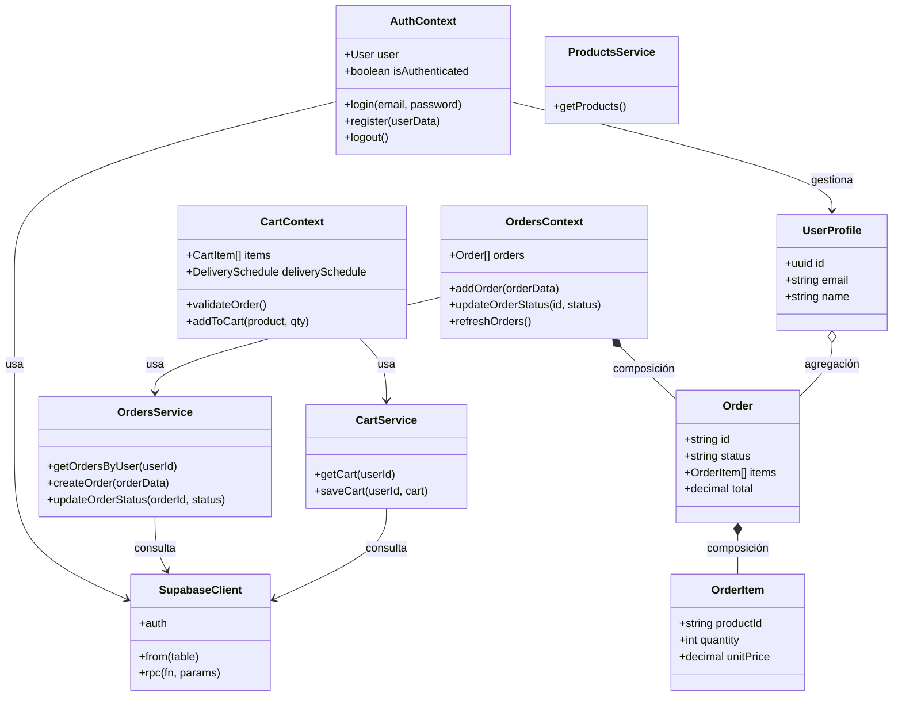
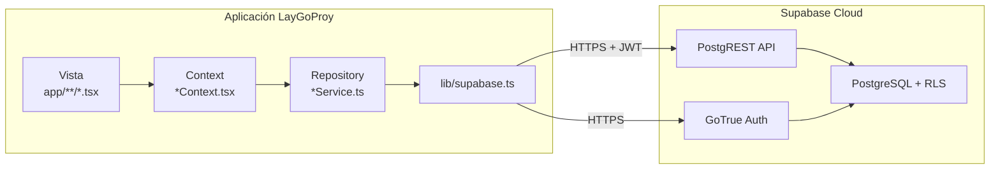
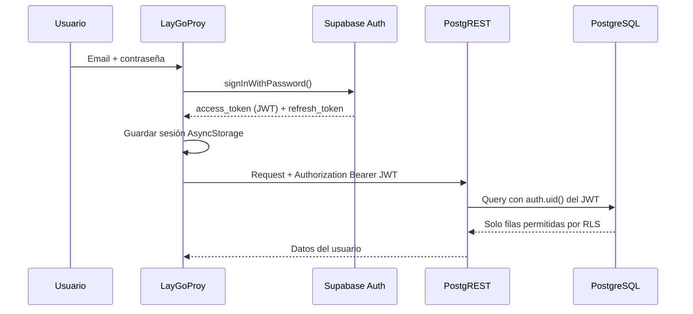
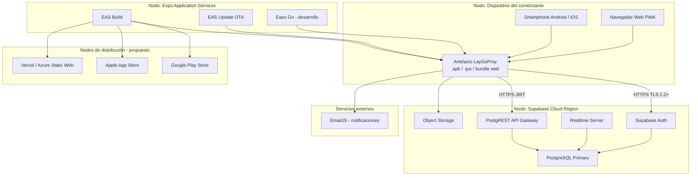

# Informe Técnico — Sistema Frito Lay (App Comerciante)

**Proyecto:** Proyecto-Frito-Lay-v2 / LayGoProy  
**Alcance:** Módulo comerciante (registro, login, catálogo, carrito, pedidos, perfil)  
**Backend:** Supabase (PostgreSQL + Auth + API REST)  
**Versión del documento:** 1.0  
**Fecha de referencia:** 2026

> **Leyenda:**  
> **✅ Implementado** = evidencia en el repositorio actual.  
> **🔮 Propuesto** = mejora o fase futura documentada con fines académicos.

---

## Índice

1. [Sección 7 — Desarrollo e Implementación Técnica](#7-desarrollo-e-implementación-técnica)
2. [Sección 8 — Implementación y Administración de Base de Datos](#8-implementación-y-administración-de-base-de-datos)
3. [Sección 9 — Seguridad del Sistema](#9-seguridad-del-sistema)
4. [Sección 10 — Validación y Verificación del Sistema](#10-validación-y-verificación-del-sistema)
5. [Sección 11 — Despliegue](#11-despliegue)
6. [Anexos](#anexos)

---

# 7. Desarrollo e Implementación Técnica

## 7.a. Arquitectura general del sistema

### Descripción

El sistema **Frito Lay – App Comerciante** adopta una arquitectura **cliente–servidor desacoplada** con backend **BaaS (Backend as a Service)** mediante **Supabase**. No existe un servidor de aplicaciones propio (Node.js/Express, Django, etc.); la lógica de negocio se distribuye entre la **aplicación móvil/web** y los **servicios gestionados en la nube** (autenticación, API REST, reglas en base de datos).

### Diagrama de arquitectura general



### Tabla de componentes tecnológicos

| Componente | Tecnología | Versión referencial | Rol en el sistema | Estado |
|------------|------------|---------------------|-------------------|--------|
| Cliente móvil/web | React Native | 0.81 | UI nativa y multiplataforma | ✅ |
| Framework | Expo | ~54 | Build, plugins, desarrollo | ✅ |
| UI Library | React | 19 | Componentes declarativos | ✅ |
| Lenguaje | TypeScript | ~5.9 | Tipado estático | ✅ |
| Navegación | Expo Router | ~6 | Rutas y stacks | ✅ |
| Estado global | React Context API | — | Auth, carrito, pedidos | ✅ |
| Persistencia local | AsyncStorage | — | Respaldo offline | ✅ |
| Almacenamiento seguro | Expo SecureStore | — | Biometría / credenciales | ✅ |
| Cliente backend | @supabase/supabase-js | ^2.81 | Auth y REST | ✅ |
| Base de datos | PostgreSQL (Supabase) | 15+ | Persistencia relacional | ✅ |
| Autenticación | Supabase Auth | — | JWT, registro, login | ✅ |
| API | PostgREST (Supabase) | — | CRUD sobre tablas | ✅ |
| Tiempo real | Supabase Realtime | — | Cambios en `orders` | ✅ |

### Capas del sistema (resumen)

| Capa | Tecnologías |
|------|-------------|
| **Presentación** | Expo, React Native, React, TypeScript, Expo Router |
| **Lógica de negocio** | Services TS, Context API, Supabase (triggers, RPC, RLS) |
| **Datos** | PostgreSQL, Supabase Auth, SQL (`setup-database-complete.sql`) |

---

## 7.b. Estructura del código fuente

### Estructura de directorios (LayGoProy)

```
LayGoProy/
├── app/                      # Capa Vista (Expo Router)
│   ├── auth/                 # Login, registro, recuperación
│   ├── (tabs)/               # Inicio, catálogo, carrito, pedidos, perfil
│   ├── profile/              # Direcciones, métodos de pago, edición
│   └── payments/             # Checkout / confirmación de pedido
├── components/               # Componentes UI reutilizables
│   └── ui/                   # ScreenHeader, FormSheetModal, AppButton…
├── contexts/                 # Estado y orquestación (≈ Controlador)
├── services/                 # Acceso a datos (≈ Repository)
├── data/                     # Modelos locales y datos semilla
├── hooks/                    # useResponsive, useColorScheme
├── lib/supabase.ts           # Cliente Supabase
└── constants/                # Tema, constantes de pago
```

**Raíz del repositorio:**

| Archivo / carpeta | Descripción |
|-------------------|-------------|
| `setup-database-complete.sql` | Script maestro de base de datos |
| `scripts/fix-user-profiles-rls.sql` | Corrección RLS y registro de perfiles |
| `docs/` | Documentación del proyecto |

### Diagrama de clases (simplificado)

Relaciones: **composición** (Order contiene OrderItem), **agregación** (UserProfile tiene Orders, Addresses), **dependencia** (Contexts → Services → Supabase).



### Patrón arquitectónico en cliente

| Patrón | Implementación en el proyecto |
|--------|-------------------------------|
| **MVC / MVVM** | Vistas en `app/`, modelos en `data/` e interfaces de contexts, control en `contexts/` + `services/` |
| **Repository** | Archivos `*Service.ts` abstraen tablas Supabase |
| **Singleton** | Cliente único en `lib/supabase.ts` |
| **Observer** | Supabase Realtime en `OrdersContext` |

---

## 7.c. Código optimizado y evidencia técnica

### Fragmento 1 — Cliente Supabase con sesión persistente ✅

**Archivo:** `LayGoProy/lib/supabase.ts`

```typescript
supabaseClient = createClient(supabaseUrl, supabaseAnonKey, {
  auth: {
    storage: AsyncStorageAdapter,
    autoRefreshToken: true,
    persistSession: true,
    detectSessionInUrl: false,
  },
});
```

**Propósito:** Mantener la sesión JWT entre reinicios de la app y renovar tokens automáticamente.

---

### Fragmento 2 — Creación de pedido (lógica de negocio) ✅

**Archivo:** `LayGoProy/services/ordersService.ts`

```typescript
const { data: order, error: orderError } = await supabase
  .from('orders')
  .insert({
    user_id: orderData.userId,
    total: totalAmount,
    wholesale_total: orderData.wholesaleTotal || totalAmount,
    status: 'pending',
    payment_status: 'pending',
    delivery_address_id: orderData.deliveryAddressId || null,
    delivery_date: orderData.deliveryDate,
    delivery_time_slot: orderData.deliveryTimeSlot,
    payment_method: orderData.paymentMethod,
    is_wholesale: orderData.isWholesale,
  })
  .select('id')
  .single();

await supabase.from('order_items').insert(orderItems);
```

**Propósito:** Persistir pedido e ítems de forma transaccional a nivel aplicación (rollback manual si fallan ítems).

---

### Fragmento 3 — Validación de pedido en carrito ✅

**Archivo:** `LayGoProy/contexts/CartContext.tsx` — método `validateOrder()`

Valida: carrito no vacío, modo mayorista si aplica, entrega programada (`deliverySchedule`), stock disponible.

---

### Fragmento 4 — Row Level Security (autorización en BD) ✅

**Archivo:** `setup-database-complete.sql`

```sql
CREATE POLICY "orders_select_own"
  ON public.orders FOR SELECT
  USING (auth.uid() = user_id);

CREATE POLICY "orders_insert_own"
  ON public.orders FOR INSERT
  WITH CHECK (auth.uid() = user_id);
```

**Propósito:** Cada comerciante solo accede a sus propios pedidos, independientemente del cliente móvil.

---

### Fragmento 5 — Registro automático de perfil ✅

**Archivos:** `setup-database-complete.sql`, `scripts/fix-user-profiles-rls.sql`

- Trigger `handle_new_user()` al insertar en `auth.users`
- RPC `ensure_user_profile(p_name, p_phone)` como respaldo
- Política `profile_insert_own` para INSERT por usuario autenticado

---

### Optimizaciones realizadas ✅

| Optimización | Beneficio |
|--------------|-----------|
| Eliminación de apps admin y repartidor | Menor complejidad y superficie de ataque |
| `ordersService` unificado (sin fallbacks legacy) | Menos consultas redundantes |
| Dependencias npm depuradas | Bundle más liviano |
| UI responsive (`useResponsive`, componentes UI) | Mejor UX en pantallas pequeñas |
| Índices en `user_id`, `created_at`, `order_id` | Consultas más rápidas |

---

## 7.d. Estrategias WPO (Web Performance Optimization)

Aplicables principalmente a la build **web** (`npm run web` / `expo export --platform web`). En Android/iOS el análogo es **rendimiento de aplicación** (TTI, fluidez).

### Medidas implementadas ✅

| # | Estrategia | Descripción |
|---|------------|-------------|
| 1 | Code splitting por rutas | Expo Router carga pantallas bajo demanda |
| 2 | expo-image | Caché y renderizado eficiente de imágenes del catálogo |
| 3 | Import dinámico de servicios | Reduce carga inicial en Auth |
| 4 | Limpieza de dependencias | Menor tamaño del bundle JavaScript |
| 5 | Diseño responsive | Menos re-renderizados por layouts rotos |

### Medidas propuestas 🔮

| # | Estrategia | Herramienta |
|---|------------|-------------|
| 1 | Minificación y tree-shaking en producción | Expo export / Metro |
| 2 | Lazy loading de módulos pesados | `React.lazy` en web |
| 3 | CDN para assets estáticos | CloudFront / Vercel Edge |
| 4 | Auditoría Lighthouse | Chrome DevTools |
| 5 | Compresión Brotli en hosting | Nginx / Vercel |

### Tabla de métricas (referencial — reemplazar con medición real)

> **Nota para el informe:** Ejecutar Lighthouse en build de producción y sustituir valores estimados por capturas.

| Métrica | Antes (estimado) | Después (estimado) | Herramienta |
|---------|------------------|--------------------|-------------|
| First Contentful Paint (FCP) | ~2.0 s | ~1.2–1.5 s | Lighthouse |
| Time to Interactive (TTI) | ~5.0 s | ~3.0–4.0 s | Lighthouse |
| Tamaño bundle JS | ~2.5 MB | ~1.8–2.0 MB | Metro bundle analyzer |
| Largest Contentful Paint (LCP) | ~3.5 s | ~2.5 s | Lighthouse |

---

# 8. Implementación y Administración de Base de Datos

## 8.a. Diseño físico de base de datos

### Diagrama Entidad-Relación (DER)

```mermaid
erDiagram
    AUTH_USERS ||--|| USER_PROFILES : "id"
    USER_PROFILES ||--o{ DELIVERY_ADDRESSES : "user_id"
    USER_PROFILES ||--o{ PAYMENT_METHODS : "user_id"
    USER_PROFILES ||--o{ ORDERS : "user_id"
    DELIVERY_ADDRESSES ||--o{ ORDERS : "delivery_address_id"
    ORDERS ||--|{ ORDER_ITEMS : "order_id"
    PRODUCTS ||--o{ ORDER_ITEMS : "product_id"
    AUTH_USERS ||--o| USER_CARTS : "user_id"

    AUTH_USERS {
        uuid id PK
        varchar email
        timestamptz created_at
    }

    USER_PROFILES {
        uuid id PK_FK
        varchar email UK
        varchar name
        varchar phone
        jsonb preferences
        boolean is_active
        timestamptz created_at
        timestamptz updated_at
    }

    DELIVERY_ADDRESSES {
        uuid id PK
        uuid user_id FK
        varchar address
        varchar zone
        boolean is_default
    }

    PAYMENT_METHODS {
        uuid id PK
        uuid user_id FK
        varchar type
        varchar name
        boolean is_default
    }

    PRODUCTS {
        uuid id PK
        varchar name
        decimal price
        decimal wholesale_price
        int stock
        boolean is_available
    }

    ORDERS {
        uuid id PK
        varchar order_number UK
        uuid user_id FK
        varchar status
        decimal total
        date delivery_date
        varchar delivery_time_slot
        uuid delivery_address_id FK
    }

    ORDER_ITEMS {
        uuid id PK
        uuid order_id FK
        uuid product_id FK
        int quantity
        decimal unit_price
        decimal subtotal
    }

    USER_CARTS {
        uuid id PK
        uuid user_id FK_UK
        jsonb items
        jsonb delivery_schedule
        boolean is_wholesale_mode
    }
```

### Catálogo de tablas

| Tabla | Descripción | Registros típicos |
|-------|-------------|-------------------|
| `auth.users` | Usuarios de autenticación (Supabase Auth) | 1 por comerciante |
| `user_profiles` | Perfil del comerciante | 1:1 con auth.users |
| `delivery_addresses` | Direcciones de entrega | N por usuario |
| `payment_methods` | Métodos de pago guardados | N por usuario |
| `products` | Catálogo Frito Lay | Catálogo maestro |
| `orders` | Pedidos realizados | N por usuario |
| `order_items` | Líneas de cada pedido | N por pedido |
| `user_carts` | Carrito persistente | 1 por usuario |

### Script SQL

| Archivo | Ubicación | Uso |
|---------|-----------|-----|
| Script maestro | `setup-database-complete.sql` | Creación completa de esquema, RLS, triggers, datos semilla |
| Fix perfiles | `scripts/fix-user-profiles-rls.sql` | Políticas INSERT, RPC, usuarios huérfanos |

---

## 8.b. Informe de Administración y Replicación

### Situación actual (Supabase Cloud) ✅

| Aspecto | Detalle |
|---------|---------|
| Motor | PostgreSQL administrado por Supabase |
| Ubicación | Región seleccionada al crear el proyecto |
| Backups automáticos | Según plan contratado (Pro: diarios + PITR) |
| Alta disponibilidad | Infraestructura del proveedor (multi-AZ en planes superiores) |
| Escalabilidad vertical | Upgrade de plan Supabase |

### Estrategia de respaldos propuesta 🔮

| Tipo | Frecuencia | Método | Retención | RPO |
|------|------------|--------|-----------|-----|
| Full automático | Diario | Supabase Backups (plan Pro) | 30 días | ≤ 24 h |
| Full manual | Semanal | `pg_dump` → almacenamiento cifrado | 90 días | ≤ 7 días |
| Incremental / WAL | Continuo | Point-in-Time Recovery (Pro) | 7 días | ≤ 1 h |
| Export lógico pre-release | Antes de cada despliegue | SQL dump en CI/CD | 3 versiones | — |

### Políticas de alta disponibilidad propuestas 🔮

| Política | Objetivo |
|----------|----------|
| RTO (Recovery Time Objective) | ≤ 4 horas en producción |
| RPO (Recovery Point Objective) | ≤ 1 hora con PITR |
| Prueba de restauración | Trimestral en entorno staging |
| Monitoreo | Alertas Supabase + uptime externo (UptimeRobot) |

---

## 8.c. Implementación del Patrón de Acceso a Datos

### Patrón adoptado: Repository + API REST (Supabase) + RLS



### Correspondencia de capas

| Capa MVC/Repository | Ubicación en proyecto | Ejemplo |
|--------------------|----------------------|---------|
| **Vista (View)** | `app/` | `app/(tabs)/cart.tsx` |
| **Controlador de estado** | `contexts/` | `CartContext.tsx` |
| **Repositorio** | `services/` | `ordersService.ts` |
| **Modelo / DTO** | `contexts/*.tsx` (interfaces), `data/` | `Order`, `Product` |
| **Acceso remoto** | `lib/supabase.ts` | `createClient()` |
| **Persistencia** | PostgreSQL | Tablas `orders`, `products`, etc. |

### Comparación con otros patrones

| Patrón | ¿Se usa? | Observación |
|--------|----------|-------------|
| **DAO** | Parcial | Cada `*Service` actúa como DAO por tabla |
| **Repository** | ✅ Principal | Abstrae Supabase del resto de la app |
| **MVC** | ✅ Variante | Contexts orquestan; vistas no acceden BD directo |
| **Active Record** | No | ORM no utilizado |

---

# 9. Seguridad del Sistema

## 9.a. Catálogo de controles de seguridad

Alineación con **OWASP Top 10 (2021)** e **ISO/IEC 27001:2022** (controles del Anexo A).

| ID | Control | Estándar | Estado | Evidencia / implementación |
|----|---------|----------|--------|---------------------------|
| C01 | Identificación y autenticación fuerte | OWASP A07 | ✅ | Supabase Auth, hash de contraseñas en servidor |
| C02 | Gestión de sesión (JWT) | OWASP A07 | ✅ | Access + refresh token, `autoRefreshToken` |
| C03 | Control de acceso (autorización) | ISO A.9 | ✅ | RLS: `auth.uid() = user_id` |
| C04 | Cifrado en tránsito | ISO A.13 | ✅ | HTTPS/TLS hacia `*.supabase.co` |
| C05 | Validación de entradas | OWASP A03 | ✅ | Formularios + `validateOrder()` |
| C06 | Principio de mínimo privilegio | ISO A.9 | ✅ | Solo `anon key` en cliente; sin `service_role` |
| C07 | Protección de secretos | ISO A.10 | ✅ | `.env` en `.gitignore` |
| C08 | Almacenamiento seguro en dispositivo | MASVS | ✅ | Expo SecureStore (biometría) |
| C09 | Confirmación de correo | OWASP A07 | ✅/config | Supabase Auth → Confirm email |
| C10 | Registro de eventos (logging) | ISO A.12 | Parcial | Logs Supabase Dashboard |
| C11 | Limitación de tasa (rate limit) | OWASP A04 | Parcial | Límites Auth Supabase (ej. 429) |
| C12 | Inventario de activos | ISO A.5 | ✅ | Repositorio Git + documentación |
| C13 | Gestión de vulnerabilidades | ISO A.8 | 🔮 | `npm audit`, Dependabot |
| C14 | Pruebas de penetración | OWASP A05 | 🔮 | Kali + OWASP ZAP (ver 9.d) |
| C15 | Autenticación multifactor (MFA) | ISO A.9 | 🔮 | Supabase MFA |
| C16 | WAF / protección perimetral | ISO A.13 | 🔮 | Cloudflare (si hay web pública) |
| C17 | Tabla de auditoría | ISO A.12 | 🔮 | `audit_log` en PostgreSQL |
| C18 | Rotación de claves API | ISO A.10 | 🔮 | Política trimestral en Supabase |

---

## 9.b. Módulo de Autenticación y Autorización

### Funcionalidades implementadas ✅

| Funcionalidad | Tecnología / archivo |
|---------------|---------------------|
| Registro de comerciante | `AuthContext.register()` → `supabase.auth.signUp()` |
| Inicio de sesión | `AuthContext.login()` → `signInWithPassword()` |
| Cierre de sesión | `supabase.auth.signOut()` |
| Sesión persistente | JWT en AsyncStorage vía adaptador custom |
| Perfil de usuario | Tabla `user_profiles` + trigger `handle_new_user` |
| Autorización de datos | RLS en todas las tablas de negocio |
| Biometría (opcional) | `expo-local-authentication` + SecureStore |
| Recuperación de contraseña | `app/auth/forgot-password.tsx` |

### Flujo de autenticación (JWT)



### Gestión de roles

| Rol | Estado | Nota |
|-----|--------|------|
| Comerciante | ✅ Único rol activo | Proyecto simplificado |
| Administrador | ❌ Eliminado del alcance | Existía en versión anterior |
| Repartidor | ❌ Eliminado del alcance | Existía en versión anterior |

**Propuesto 🔮:** Reintroducir roles con columna `role` y políticas RLS por rol si se expande el ecosistema.

---

## 9.c. Informe Técnico de Seguridad y Cifrado de Datos

### Mecanismos de cifrado y protección

| Mecanismo | Estándar / algoritmo | Dónde se aplica | Estado |
|-----------|---------------------|-----------------|--------|
| TLS 1.2+ | SSL/TLS | App ↔ Supabase | ✅ |
| JWT | HS256 / RS256 (Supabase) | Cabecera `Authorization` | ✅ |
| Hash de contraseñas | bcrypt (Supabase Auth) | `auth.users` (servidor) | ✅ |
| Cifrado en reposo | AES-256 (infra AWS) | Discos Supabase | ✅ (proveedor) |
| SHA-256 | Integridad JWT | Tokens | ✅ |
| SecureStore | Cifrado SO (Keychain/Keystore) | Credenciales biométricas | ✅ |
| RLS | Políticas PostgreSQL | Tablas `public.*` | ✅ |
| Cifrado manual AES en app | — | No implementado | N/A |

### Datos sensibles tratados

| Dato | Almacenamiento | Protección |
|------|----------------|------------|
| Contraseña | Supabase Auth | Hash, nunca en texto plano en app |
| Token de sesión | AsyncStorage | JWT firmado, expiración |
| Tarjeta (si se guarda) | `payment_methods.card_number` | Parcial enmascarado en UI; 🔮 tokenización PCI |
| Direcciones | `delivery_addresses` | RLS por usuario |
| Pedidos | `orders`, `order_items` | RLS por `user_id` |

### Trazabilidad y logs de auditoría

| Fuente | Contenido | Estado |
|--------|-----------|--------|
| Supabase → Logs | Auth, API, errores Postgres | ✅ Disponible |
| `orders.created_at` / `updated_at` | Trazabilidad de pedidos | ✅ |
| Tabla `audit_log` dedicada | Acciones CRUD con IP | 🔮 Propuesto |

**Script propuesto para auditoría 🔮:**

```sql
CREATE TABLE IF NOT EXISTS public.audit_log (
  id UUID PRIMARY KEY DEFAULT gen_random_uuid(),
  user_id UUID REFERENCES auth.users(id) ON DELETE SET NULL,
  action VARCHAR(100) NOT NULL,
  entity VARCHAR(50),
  entity_id UUID,
  metadata JSONB,
  ip_address INET,
  created_at TIMESTAMPTZ NOT NULL DEFAULT NOW()
);

ALTER TABLE public.audit_log ENABLE ROW LEVEL SECURITY;
-- Solo lectura por el propio usuario o service_role en panel admin futuro
```

---

## 9.d. Pruebas de seguridad web

### Alcance de pruebas

| Entorno | URL / objetivo | Autorización |
|---------|----------------|--------------|
| Staging web | Build `expo export --platform web` | Solo entorno de prueba propio |
| API Supabase | `https://<proyecto>.supabase.co` | Proyecto del desarrollador |

### Herramientas planificadas

| Herramienta | Plataforma | Objetivo |
|-------------|------------|----------|
| OWASP ZAP | Windows/Linux | XSS, headers, CSRF |
| Kali Linux | VM | nikto, nmap, sqlmap (solo staging autorizado) |
| Supabase Advisors | Web | RLS, índices, seguridad |
| npm audit | CLI | CVE en dependencias |

### Plantilla de reporte de vulnerabilidades

> Completar tras ejecutar escaneos reales. Las filas siguientes son **ejemplo de formato**.

| ID | Hallazgo | OWASP | Severidad | Herramienta | Estado | Acción correctiva |
|----|----------|-------|-----------|-------------|--------|-------------------|
| V-001 | Falta Content-Security-Policy en web | A05 | Media | ZAP | Abierto | Configurar CSP en hosting |
| V-002 | Dependencia con CVE moderado | A06 | Media | npm audit | Abierto | `npm audit fix` |
| V-003 | Email confirmation desactivado en dev | A07 | Baja | Manual | Cerrado | Activar en producción |
| V-004 | Política DELETE no definida en orders | A01 | Baja | Supabase Advisor | Abierto | Evaluar si se necesita DELETE |
| V-005 | Rate limit en registro (429) | A04 | Info | Manual | Cerrado | Desactivar confirm email en dev |

### Evidencias a adjuntar en el informe final

1. Captura de OWASP ZAP — resumen de alertas.  
2. Captura de Supabase Advisors — sin errores críticos de RLS.  
3. Captura de `npm audit` — resumen.  
4. Captura de políticas RLS en SQL Editor.

---

# 10. Validación y Verificación del Sistema

## 10.a. Plan de pruebas del sistema

### Objetivo

Verificar que el sistema cumple los requisitos del **comerciante minorista**: autenticarse, explorar catálogo, gestionar carrito, programar entrega, confirmar pedido y consultar historial, con persistencia correcta en Supabase.

### Alcance

| Incluido | Excluido |
|----------|----------|
| LayGoProy (Android, iOS, Web) | Panel administrador |
| Integración Supabase | App repartidor |
| Auth, catálogo, carrito, pagos, pedidos, perfil | Pasarela de pago bancaria real |
| RLS y registro de usuarios | |

### Tipos de prueba

| Tipo | Descripción | Responsable |
|------|-------------|-------------|
| Funcional | Casos según requisitos | Desarrollador / QA |
| Integración | App ↔ Supabase | Desarrollador |
| Regresión | Tras cambios en services o SQL | Desarrollador |
| Usabilidad | Pantallas &lt; 360px, flujos completos | Usuario piloto |
| Rendimiento | Lighthouse (web) | Desarrollador |
| Seguridad | RLS, auth (sección 9) | Desarrollador |

### Cronograma propuesto (4 semanas)

| Semana | Actividades | Entregable |
|--------|-------------|------------|
| 1 | CP Auth, registro, perfil | Acta de pruebas S1 |
| 2 | CP catálogo, carrito, scheduler | Acta S2 |
| 3 | CP checkout, pedidos, RLS | Acta S3 |
| 4 | Regresión, usabilidad, cierre | Informe final + capturas |

### Criterios de aceptación

| Criterio | Condición de éxito |
|----------|-------------------|
| Registro | Usuario en Auth + fila en `user_profiles` |
| Pedido | Filas en `orders` y `order_items` |
| Aislamiento | Usuario A no ve datos de usuario B |
| UX crítica | Sin bloqueos en flujo compra completo |

---

## 10.b. Evidencias de pruebas del sistema

### Matriz de casos de prueba

| ID | Módulo | Caso de prueba | Pasos resumidos | Resultado esperado | Resultado* | Evidencia |
|----|--------|----------------|-----------------|-------------------|-----------|-----------|
| CP-01 | Auth | Registro exitoso | Completar formulario registro | Cuenta creada, mensaje éxito | | Captura registro |
| CP-02 | Auth | Login válido | Email + password correctos | Acceso a tabs principales | | Captura inicio |
| CP-03 | Auth | Email no confirmado | Login sin confirmar email | Alerta clara, sin modo local | | Captura alerta |
| CP-04 | Auth | Credenciales inválidas | Password incorrecto | Mensaje error | | Captura error |
| CP-05 | Catálogo | Listar productos | Abrir tab Catálogo | Productos desde `products` | | Captura catálogo |
| CP-06 | Carrito | Agregar producto | Seleccionar cantidad y agregar | Contador carrito actualizado | | Captura carrito |
| CP-07 | Carrito | Validar sin entrega | Ir a pagar sin agendar | Mensaje validación | | Captura validación |
| CP-08 | Entrega | Programar entrega | Completar DeliveryScheduler | `delivery_schedule` guardado | | Captura scheduler |
| CP-09 | Pedidos | Crear pedido | Checkout en payments | Registro en `orders` + ítems | | Captura + Supabase |
| CP-10 | Pedidos | Historial | Tab Pedidos | Lista pedidos del usuario | | Captura pedidos |
| CP-11 | Perfil | Agregar dirección | Profile → direcciones → agregar | Fila en `delivery_addresses` | | Captura + BD |
| CP-12 | Perfil | Agregar método pago | Profile → métodos pago | Fila en `payment_methods` | | Captura + BD |
| CP-13 | Seguridad | RLS | Usuario A vs B | A no ve pedidos de B | 0 registros ajenos | | Captura Table Editor |
| CP-14 | UI | Responsive | Pantalla estrecha | Textos y botones legibles | | Captura móvil pequeño |
| CP-15 | Offline | Sin Supabase | Desactivar red* | Fallback local / mensaje | | Captura |

\* *Columna "Resultado": completar con OK / FALLO / N/A al ejecutar.*  
\* *CP-15: comportamiento esperado según configuración; documentar observación real.*

### Plantilla de registro de incidencia

| Campo | Valor |
|-------|-------|
| ID incidencia | INC-___ |
| Caso de prueba | CP-___ |
| Severidad | Alta / Media / Baja |
| Descripción | |
| Pasos para reproducir | |
| Resultado actual | |
| Resultado esperado | |
| Estado | Abierto / Cerrado |

---

# 11. Despliegue

## 11.a. Manual de despliegue

### Diagrama de despliegue (UML)



### Requisitos previos

| Requisito | Versión mínima |
|-----------|----------------|
| Node.js | 18 LTS o superior |
| npm | 9+ |
| Cuenta Expo | expo.dev |
| Cuenta Supabase | supabase.com |
| Android Studio / Xcode | Para emuladores (opcional) |

### Procedimiento paso a paso

#### Fase 1 — Base de datos (Supabase) ✅

1. Crear proyecto en [https://supabase.com](https://supabase.com).  
2. Abrir **SQL Editor**.  
3. Ejecutar el contenido completo de `setup-database-complete.sql`.  
4. Ejecutar `scripts/fix-user-profiles-rls.sql`.  
5. En **Authentication → Providers → Email**, configurar confirmación de email según entorno (desarrollo: desactivada; producción: activada).  
6. Copiar **Project URL** y **anon public key**.  
7. (Opcional) Habilitar **Realtime** en tabla `orders`.

#### Fase 2 — Configuración de la aplicación ✅

1. Clonar el repositorio.  
2. `cd LayGoProy`  
3. Crear archivo `.env`:

```env
EXPO_PUBLIC_SUPABASE_URL=https://TU_PROYECTO.supabase.co
EXPO_PUBLIC_SUPABASE_ANON_KEY=tu_anon_key
```

4. `npm install`  
5. Verificar: `npm start` → escanear QR con Expo Go o `a` / `w` para Android/Web.

#### Fase 3 — Build de producción

| Plataforma | Comando | Salida |
|------------|---------|--------|
| Android APK/AAB | `eas build --platform android` | `.apk` / `.aab` |
| iOS IPA | `eas build --platform ios` | `.ipa` |
| Web estática | `npx expo export --platform web` | Carpeta `dist/` |

**Requisitos EAS 🔮:** cuenta Expo, `eas.json`, certificados Android keystore y Apple Developer.

#### Fase 4 — Publicación 🔮

| Canal | Acción |
|-------|--------|
| Google Play | Subir AAB en Play Console |
| App Store | Subir IPA vía Transporter / Xcode |
| Web | Desplegar `dist/` en Vercel, Netlify o Azure Static Web Apps |

### Variables de entorno en producción

| Variable | Dónde configurar | Secreto |
|----------|------------------|---------|
| `EXPO_PUBLIC_SUPABASE_URL` | EAS Secrets / `.env` | No |
| `EXPO_PUBLIC_SUPABASE_ANON_KEY` | EAS Secrets | Pública (protegida por RLS) |
| `SUPABASE_SERVICE_ROLE_KEY` | **Solo servidor/backend** | **Nunca en la app** |

---

## 11.b. Evidencia de pruebas de despliegue

### Estado actual del despliegue

| Componente | Entorno | Estado |
|------------|---------|--------|
| Base de datos | Supabase Cloud | ✅ Implementado |
| App cliente | Local / Expo Go | ✅ Implementado |
| Build EAS producción | expo.dev | 🔮 Propuesto |
| Hosting web cloud | Vercel / Azure / AWS | 🔮 Propuesto |
| Tiendas (Play / App Store) | — | 🔮 Propuesto |

### Checklist de evidencias (capturas para el informe)

| # | Descripción de captura | Plataforma cloud |
|---|------------------------|------------------|
| 1 | Dashboard Supabase — tablas creadas | Supabase |
| 2 | Authentication — usuarios registrados | Supabase |
| 3 | Table Editor — pedido de prueba en `orders` | Supabase |
| 4 | App funcionando en emulador Android | Local / EAS |
| 5 | Pantalla de login + catálogo en dispositivo real | Local |
| 6 | Panel expo.dev — build completado | EAS 🔮 |
| 7 | URL pública web en Vercel/Azure | Cloud 🔮 |
| 8 | Google Play Console — app en revisión | Cloud 🔮 |

### Texto sugerido para el informe (si aún no hay cloud completo)

> *"En la fase actual, la capa de datos se encuentra desplegada en **Supabase Cloud**, verificada mediante el Table Editor y pruebas de integración desde la aplicación LayGoProy ejecutada en entorno de desarrollo (Expo). El despliegue de artefactos de producción en **Expo Application Services (EAS)** y distribución en tiendas de aplicaciones se contempla como fase 2 del proyecto, con hosting web estático en **Vercel o Azure Static Web Apps**."*

---

# Anexos

## Anexo A — Tecnologías por capa (resumen)

| Capa | Tecnologías |
|------|-------------|
| Presentación | Expo 54, React Native 0.81, React 19, TypeScript, Expo Router |
| Lógica de negocio | Context API, Services TS, Supabase Auth/API, triggers y RPC PostgreSQL |
| Datos | PostgreSQL (Supabase), RLS, SQL |

## Anexo B — Archivos de evidencia en el repositorio

| Archivo | Sección relacionada |
|---------|---------------------|
| `setup-database-complete.sql` | 8.a |
| `scripts/fix-user-profiles-rls.sql` | 8.a, 9.b |
| `LayGoProy/lib/supabase.ts` | 7.c, 9.b |
| `LayGoProy/services/ordersService.ts` | 7.c |
| `LayGoProy/contexts/AuthContext.tsx` | 9.b |
| `LayGoProy/contexts/CartContext.tsx` | 7.c, 10.b |

## Anexo C — Cómo usar este documento en Microsoft Word

1. Abrir el archivo `.md` en un editor o copiar todo el contenido.  
2. Pegar en Word (mantener formato Markdown si se usa plugin, o pegar como texto).  
3. **Diagramas Mermaid:** exportar cada bloque en [https://mermaid.live](https://mermaid.live) como PNG/SVG e insertar en Word.  
4. Ajustar estilos de tabla: **Insertar → Tabla → Convertir texto en tabla** (separador `|`).  
5. Completar columnas marcadas con `*` en casos de prueba tras ejecutar CP-01 a CP-15.  
6. Adjuntar capturas según checklist sección 11.b.

---

**Fin del documento**
